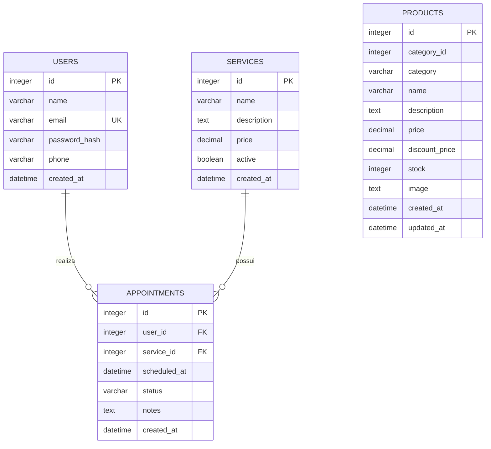

# DER — Galeria Seleta

Modelo solicitado para a Sprint 1, contemplando as entidades principais **Usuários, Agendamentos, Produtos e Serviços**.

## Relacionamentos

- Um **usuário** pode possuir zero ou vários **agendamentos**.
- Um **serviço** pode estar associado a zero ou vários **agendamentos**.
- Cada **agendamento** referencia exatamente um usuário e um serviço.
- **Produtos** são mantidos como entidade independente no escopo atual do e-commerce e possuem CRUD no aplicativo.
